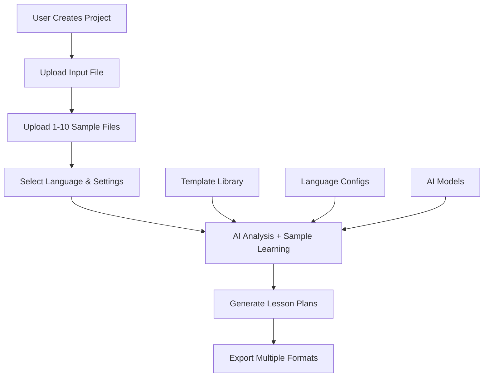

# Enhanced Lesson Plan Generation System

## 📋 Overview

This document outlines the comprehensive enhancement of the lesson plan generation system to support:
- **Sample file-based generation** using 1-10 template files
- **Generic project/course creation** for different subjects and templates
- **Multi-language support** with cultural adaptation
- **Improved AI accuracy** through template enforcement

## 🎯 Problem Statement

### Current Issues
1. **Low AI Accuracy**: LLM only uses text prompts, cannot replicate exact formatting/styles
2. **Fixed Templates**: System only supports one lesson plan format
3. **No Sample Files**: Cannot provide actual examples for AI to learn from
4. **Language Limitations**: Rigid multi-language support
5. **Non-Generic**: Cannot handle different subjects or template types

### Solution Goals
1. **95% Format Accuracy**: Lesson plans match samples exactly
2. **Generic System**: Support any subject/template combination
3. **Sample-Driven AI**: Use 1-10 actual sample files for learning
4. **Flexible Multi-Language**: Easy language switching and cultural adaptation
5. **Reusable Templates**: Save and reuse templates across projects

## 🏗️ System Architecture

### Enhanced Flow


### Core Components

#### 1. **Project Management System**
- Multi-project support with isolated data
- Project-specific templates and configurations
- Version control for templates and generated content

#### 2. **Template Engine**
- Parse markdown/docx templates with variable detection
- Extract formatting structure and styles
- Dynamic prompt generation from templates

#### 3. **Enhanced AI Service**
- Sample file integration in prompts
- Format enforcement and validation
- Multi-language prompt templates

#### 4. **Multi-Language Framework**
- Language-specific configurations
- Cultural adaptation settings
- Localized AI prompts

## 📊 Database Schema Changes

### New Tables

#### Projects Table
```sql
CREATE TABLE projects (
    id UUID PRIMARY KEY DEFAULT gen_random_uuid(),
    name VARCHAR(255) NOT NULL,
    description TEXT,
    language VARCHAR(10) NOT NULL DEFAULT 'zh',
    input_format VARCHAR(50) NOT NULL DEFAULT 'excel',
    created_by VARCHAR(255),
    created_at TIMESTAMP DEFAULT NOW(),
    updated_at TIMESTAMP DEFAULT NOW(),
    is_active BOOLEAN DEFAULT true
);
```

#### Templates Table
```sql
CREATE TABLE templates (
    id UUID PRIMARY KEY DEFAULT gen_random_uuid(),
    project_id UUID REFERENCES projects(id) ON DELETE CASCADE,
    name VARCHAR(255) NOT NULL,
    type VARCHAR(50) NOT NULL, -- 'lesson_plan', 'summary', 'flashcard'
    file_name VARCHAR(255) NOT NULL,
    file_path VARCHAR(500),
    file_content TEXT,
    variables JSONB, -- Detected variables from template
    is_active BOOLEAN DEFAULT true,
    created_at TIMESTAMP DEFAULT NOW()
);
```

#### Language Configs Table
```sql
CREATE TABLE language_configs (
    id UUID PRIMARY KEY DEFAULT gen_random_uuid(),
    language_code VARCHAR(10) NOT NULL UNIQUE,
    language_name VARCHAR(100) NOT NULL,
    direction VARCHAR(3) DEFAULT 'ltr',
    ai_prompts JSONB, -- Language-specific prompts
    cultural_settings JSONB,
    created_at TIMESTAMP DEFAULT NOW()
);
```

#### Updated Lessons Table
```sql
ALTER TABLE lessons ADD COLUMN project_id UUID REFERENCES projects(id) ON DELETE CASCADE;
ALTER TABLE lessons ADD COLUMN template_id UUID REFERENCES templates(id);
ALTER TABLE lessons ADD COLUMN language VARCHAR(10) DEFAULT 'zh';
ALTER TABLE lessons ADD COLUMN format_match_score DECIMAL(3,2); -- AI confidence in format matching
```

## 🔧 API Enhancements

### New Endpoints

#### Project Management (`/api/projects`)
```typescript
// Create new project
POST /api/projects
{
  name: string;
  description?: string;
  language: string;
  input_format: 'excel' | 'pdf' | 'text';
}

// List projects
GET /api/projects
// Query params: ?language=zh&active=true

// Get project details
GET /api/projects/:id

// Update project
PUT /api/projects/:id

// Delete project
DELETE /api/projects/:id
```

#### Template Management (`/api/projects/:id/templates`)
```typescript
// Upload templates
POST /api/projects/:id/templates
Content-Type: multipart/form-data
{
  templates: File[]; // 1-10 files (markdown/docx)
  type: 'lesson_plan' | 'summary' | 'flashcard';
}

// List project templates
GET /api/projects/:id/templates

// Get template content
GET /api/projects/:id/templates/:templateId

// Delete template
DELETE /api/projects/:id/templates/:templateId

// Update template variables
PUT /api/projects/:id/templates/:templateId/variables
{
  variables: {
    unit: "number",
    lesson: "number",
    vocabulary: "string[]",
    // ... auto-detected variables
  };
}
```

#### Enhanced Generation (`/api/projects/:id/generate`)
```typescript
// Generate with samples
POST /api/projects/:id/generate
{
  input_file: File; // Excel with course data
  template_ids?: UUID[]; // Optional: specific templates to use
  options: {
    language?: string;
    enforce_format?: boolean;
    sample_count?: number; // How many samples to include in prompt
    quality_threshold?: number; // Minimum format matching score
  };
}
```

### Enhanced Existing Endpoints

#### Updated Course Operations (`/api/course-ops`)
```typescript
// Enhanced generate action with template support
POST /api/course-ops?action=generate
{
  project_id?: UUID; // Optional: project context
  template_ids?: UUID[]; // Optional: specific templates
  unit: number;
  lesson: number;
  use_samples?: boolean; // New: include template samples
  sample_limit?: number; // New: max samples in prompt
}

// New template upload action
POST /api/course-ops?action=upload-templates
Content-Type: multipart/form-data
{
  templates: File[];
  project_id?: UUID;
  type: 'lesson_plan';
}
```

## 🤖 Enhanced AI Integration

### Sample File Processing
```typescript
interface TemplateAnalysis {
  variables: {
    name: string;
    type: 'string' | 'number' | 'array' | 'object';
    required: boolean;
    examples: any[];
  }[];
  structure: {
    headers: string[];
    tables: TableStructure[];
    sections: SectionStructure[];
  };
  formatting: {
    markdown_style: 'github' | 'standard';
    table_format: 'pipe' | 'grid';
    language_patterns: string[];
  };
}

export async function analyzeTemplate(fileContent: string): Promise<TemplateAnalysis>
```

### Enhanced Generation with Samples
```typescript
export async function generateLessonPlanWithSamples(
  lessonData: LessonData,
  templates: Template[],
  options: {
    language?: string;
    maxSamples?: number;
    enforceFormat?: boolean;
  } = {}
): Promise<GeneratedContent> {

  // Select best matching templates
  const selectedTemplates = selectBestTemplates(templates, lessonData, options.maxSamples);

  // Extract structure and format
  const templateStructures = await Promise.all(
    selectedTemplates.map(t => analyzeTemplate(t.content))
  );

  // Build enhanced prompt with samples
  const enhancedPrompt = buildEnhancedPrompt({
    lessonData,
    samples: selectedTemplates,
    structures: templateStructures,
    language: options.language || 'zh'
  });

  // Generate with format enforcement
  const generated = await callAI(enhancedPrompt);

  // Validate and score format matching
  const validation = await validateFormat(generated, templateStructures);

  return {
    content: generated,
    format_score: validation.score,
    used_templates: selectedTemplates.map(t => t.id),
    suggestions: validation.suggestions
  };
}
```

### Enhanced Prompt Template
```typescript
const ENHANCED_PROMPT_TEMPLATE = `
Bạn là chuyên gia tạo giáo án {{language}} với kinh nghiệm nhiều năm.

DƯỚI ĐÂY LÀ CÁC FILE MẪU THAM KHẢO:
{{#each samples}}
---
### MẪU {{@index}}: {{this.name}}
{{this.content}}
---
{{/each}}

YÊU CẦU TẠO GIÁO ÁN MỚI:
- Input data: {{json lessonData}}
- Variables cần fill: {{#each variables}}{{this.name}} ({{this.type}}){{#unless @last}}, {{/unless}}{{/each}}
- Ngôn ngữ: {{language}}
- Format: PHẢI GIỐNG HỆT như các mẫu trên

QUAN TRỌNG:
1. Giữ nguyên CẤU TRÚC, STYLE, ĐỊNH DẠNG của mẫu
2. Không thay đổi table structure, headers, formatting
3. Sử dụng chính xác variables được cung cấp
4. Bắt chước ngôn ngữ và văn phong của mẫu
5. Format phải matching >90% so với mẫu

{{#if additionalInstructions}}
HƯỚNG DẪN BỔ SUNG:
{{additionalInstructions}}
{{/if}}

Output giáo án mới ở định dạng markdown:
`;
```

## 🌐 Multi-Language Framework

### Language Configuration Structure
```typescript
interface LanguageConfig {
  code: string;           // 'zh', 'vi', 'en'
  name: string;           // 'Chinese', 'Vietnamese', 'English'
  direction: 'ltr' | 'rtl';

  // AI prompts localized for this language
  ai_prompts: {
    lesson_plan: string;
    analysis: string;
    summary: string;
    flashcard: string;
  };

  // Cultural and educational adaptations
  cultural_settings: {
    classroom_structure: string;
    teaching_methods: string[];
    assessment_styles: string[];
    formality_level: 'formal' | 'informal' | 'mixed';
  };

  // Formatting preferences
  formatting: {
    date_format: string;
    time_format: string;
    number_format: string;
    currency: string;
  };
}
```

### Default Language Configs

#### Chinese (zh)
```json
{
  "code": "zh",
  "name": "Chinese",
  "cultural_settings": {
    "classroom_structure": "teacher-centered with group activities",
    "teaching_methods": ["repetition", "games", "calligraphy", "storytelling"],
    "assessment_styles": ["written", "oral", "practical"],
    "formality_level": "formal"
  },
  "ai_prompts": {
    "lesson_plan": "请根据以下模板创建中文教学计划..."
  }
}
```

#### Vietnamese (vi)
```json
{
  "code": "vi",
  "name": "Vietnamese",
  "cultural_settings": {
    "classroom_structure": "student-centered collaborative",
    "teaching_methods": ["discussion", "practice", "group work"],
    "assessment_styles": ["continuous", "project-based"],
    "formality_level": "mixed"
  },
  "ai_prompts": {
    "lesson_plan": "Vui lòng tạo giáo án tiếng Việt dựa trên mẫu sau..."
  }
}
```

## 🎨 Frontend Enhancements

### New Components

#### Project Manager (`ProjectManager.tsx`)
```typescript
interface ProjectManagerProps {
  onProjectSelect: (project: Project) => void;
  onProjectCreate: () => void;
}

// Features:
- List all projects with filtering
- Create new project wizard
- Project cards with stats
- Language/format indicators
```

#### Template Manager (`TemplateManager.tsx`)
```typescript
interface TemplateManagerProps {
  projectId: UUID;
  onTemplateUpload: (files: File[]) => void;
  onTemplateDelete: (templateId: UUID) => void;
}

// Features:
- Drag & drop template upload
- Template preview (markdown/docx)
- Variable detection display
- Template validation
```

#### Enhanced Generation Dashboard (`GenerationDashboard.tsx`)
```typescript
interface GenerationDashboardProps {
  projectId: UUID;
}

// Features:
- Input file upload with preview
- Template selection with preview
- Generation options (language, quality settings)
- Real-time generation progress
- Format matching scores
- Results review and editing
```

### Updated Components

#### Enhanced Workflow (`KanbanBoard.tsx`)
- Add project context to all steps
- Template selection in Step 2 (Plan)
- Format matching indicators
- Multi-language generation options

#### Improved Flashcard Editor (`FlashcardEditor.tsx`)
- Language-specific image search
- Cultural context awareness
- Multi-language pronunciation support

## 📋 Implementation Tasks

### Phase 1: Foundation (Week 1-2)
1. Database schema and migrations
2. Project management API
3. Template upload system
4. Basic template analysis

### Phase 2: AI Enhancement (Week 2-3)
1. Sample file integration in AI prompts
2. Template structure analysis
3. Format matching validation
4. Enhanced generation endpoints

### Phase 3: Frontend (Week 3-4)
1. Project manager UI
2. Template manager interface
3. Enhanced workflow components
4. Multi-language support

### Phase 4: Testing & Polish (Week 4-5)
1. Integration testing
2. Format accuracy validation
3. Performance optimization
4. Documentation completion

## ✅ Acceptance Criteria

### Core Functionality
- [ ] Upload 1-10 sample template files per project
- [ ] Auto-detect variables from template files
- [ ] Generate lesson plans matching sample format >95%
- [ ] Support multiple projects with isolation
- [ ] Multi-language generation with cultural adaptation

### Quality Metrics
- [ ] Format matching accuracy >95%
- [ ] Template variable extraction >90%
- [ ] AI response time <30 seconds
- [ ] Support for files up to 10MB
- [ ] System uptime >99%

### User Experience
- [ ] Intuitive drag & drop interface
- [ ] Real-time preview of templates
- [ ] Progress indicators for generation
- [ ] Error handling with helpful messages
- [ ] Mobile-responsive design

## 🚀 Future Enhancements

### Short Term (Next 3 months)
- **Template Marketplace**: Share and download templates
- **Batch Generation**: Generate entire units at once
- **Advanced Analytics**: Template performance tracking
- **Collaboration**: Multi-user editing and sharing

### Long Term (6+ months)
- **AI Template Creation**: Auto-generate templates from examples
- **Custom AI Training**: Fine-tune models on specific templates
- **Integration APIs**: Connect with LMS and other platforms
- **Voice & Audio**: Generate pronunciation guides and audio content

## 📚 Additional Resources

- [API Documentation](./api-reference.md)
- [Database Schema](./database-schema.md)
- [Frontend Components Guide](./frontend-components.md)
- [Testing Strategy](./testing-strategy.md)
- [Deployment Guide](./deployment.md)