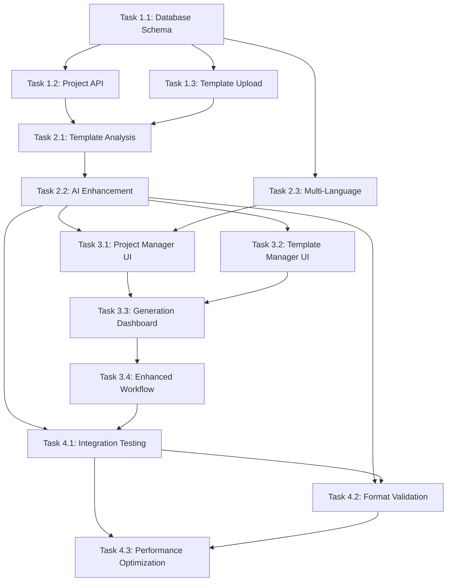

# Implementation Tasks - Enhanced Lesson Plan System

## 📋 Project Overview

**Project**: Enhanced Lesson Plan Generation System
**Duration**: 5 weeks
**Team**: Full-stack developer + AI/ML specialist
**Goal**: Implement sample file-based, generic, multi-language lesson plan generation

---

## 🏗️ Phase 1: Foundation & Database (Week 1-2)

### Task 1.1: Database Schema & Migrations
**Assignee**: Backend Developer
**Priority**: Critical
**Estimated Time**: 3 days

#### Acceptance Criteria:
- [ ] Create new tables: `projects`, `templates`, `language_configs`
- [ ] Add foreign key relationships with proper constraints
- [ ] Create migration scripts for existing data
- [ ] Add indexes for performance optimization
- [ ] Update existing `lessons` table with new columns
- [ ] Add database documentation

#### Technical Details:
```sql
-- Core migrations needed
001_create_projects_table.sql
002_create_templates_table.sql
003_create_language_configs_table.sql
004_update_lessons_table.sql
005_add_indexes.sql
```

#### Definition of Done:
- Database schema reviewed and approved
- Migration scripts tested on staging
- Performance benchmarks completed
- Documentation updated

---

### Task 1.2: Project Management API
**Assignee**: Backend Developer
**Priority**: Critical
**Estimated Time**: 4 days

#### Acceptance Criteria:
- [ ] Implement `/api/projects` CRUD operations
- [ ] Add project validation and error handling
- [ ] Implement authentication for project access
- [ ] Add input sanitization and validation
- [ ] Create comprehensive API tests
- [ ] Add rate limiting and security measures

#### API Endpoints:
```typescript
// Required endpoints
POST   /api/projects          // Create project
GET    /api/projects          // List projects
GET    /api/projects/:id      // Get project details
PUT    /api/projects/:id      // Update project
DELETE /api/projects/:id      // Delete project
```

#### Technical Requirements:
- TypeScript with proper types
- Input validation using Zod
- Error handling with status codes
- Request logging and monitoring
- Unit and integration tests

#### Definition of Done:
- All endpoints implemented and tested
- API documentation generated
- Security review completed
- Performance testing passed

---

### Task 1.3: Template Upload System
**Assignee**: Backend Developer
**Priority**: Critical
**Estimated Time**: 4 days

#### Acceptance Criteria:
- [ ] Implement multi-file upload (1-10 files)
- [ ] Support .md and .docx file formats
- [ ] Parse and extract content from files
- [ ] Store files with proper organization
- [ ] Add file validation and size limits
- [ ] Implement duplicate detection

#### File Processing:
```typescript
// Required functions
parseMarkdownFile(file: Buffer): TemplateContent
parseDocxFile(file: Buffer): TemplateContent
validateTemplate(content: string): ValidationResult
extractVariables(content: string): Variable[]
storeTemplateFile(projectId: UUID, file: File): Promise<string>
```

#### Technical Requirements:
- File size limit: 10MB per file
- Virus scanning for uploaded files
- Cloud storage integration (AWS S3)
- File type validation
- Error handling for corrupted files

#### Definition of Done:
- File upload tested with various formats
- Storage integration working
- File processing validated
- Error handling comprehensive
- Documentation complete

---

## 🤖 Phase 2: AI Enhancement (Week 2-3)

### Task 2.1: Template Analysis Engine
**Assignee**: AI/ML Specialist
**Priority**: High
**Estimated Time**: 5 days

#### Acceptance Criteria:
- [ ] Parse markdown structure and formatting
- [ ] Extract table structures and headers
- [ ] Detect template variables automatically
- [ ] Analyze language patterns and style
- [ ] Generate template metadata
- [ ] Validate template completeness

#### Core Functions:
```typescript
interface TemplateAnalysis {
  variables: Variable[];
  structure: TemplateStructure;
  formatting: FormattingRules;
  language: LanguageDetection;
  quality_score: number;
}

export class TemplateAnalyzer {
  analyze(content: string): TemplateAnalysis
  detectVariables(content: string): Variable[]
  extractStructure(content: string): TemplateStructure
  validateCompleteness(analysis: TemplateAnalysis): ValidationResult
}
```

#### Technical Requirements:
- Support multiple markdown formats
- Table structure recognition
- Variable pattern detection (`{{variable}}`, `%variable%`, etc.)
- Language detection (Chinese, Vietnamese, English)
- Quality scoring algorithm

#### Definition of Done:
- Template analysis accuracy >95%
- Variable detection >90%
- Support for common template formats
- Performance <2 seconds per template
- Comprehensive test coverage

---

### Task 2.2: Enhanced AI Generation with Samples
**Assignee**: AI/ML Specialist
**Priority**: Critical
**Estimated Time**: 5 days

#### Acceptance Criteria:
- [ ] Integrate sample files into AI prompts
- [ ] Implement template format enforcement
- [ ] Add format matching validation
- [ ] Create multi-language prompt templates
- [ ] Optimize prompt engineering
- [ ] Add quality scoring and validation

#### Enhanced Generation Flow:
```typescript
export async function generateWithSamples(
  lessonData: LessonData,
  templates: Template[],
  options: GenerationOptions
): Promise<GenerationResult> {
  // 1. Select best matching templates
  const selected = selectBestTemplates(templates, lessonData);

  // 2. Analyze template structures
  const analyses = await Promise.all(
    selected.map(t => templateAnalyzer.analyze(t.content))
  );

  // 3. Build enhanced prompt with samples
  const prompt = buildEnhancedPrompt({
    lessonData,
    samples: selected,
    structures: analyses,
    language: options.language
  });

  // 4. Generate with AI
  const generated = await callAI(prompt, options.model);

  // 5. Validate format matching
  const validation = await validateFormat(
    generated,
    analyses
  );

  return {
    content: generated,
    format_score: validation.score,
    used_templates: selected.map(t => t.id),
    suggestions: validation.suggestions
  };
}
```

#### Technical Requirements:
- Support for multiple AI models (GLM-4.6, GPT-5-nano)
- Context window optimization
- Format matching algorithm
- Quality threshold enforcement
- Fallback strategies

#### Definition of Done:
- Format matching accuracy >95%
- Generation time <30 seconds
- Support for 3+ template formats
- Quality scoring implemented
- Comprehensive testing

---

### Task 2.3: Multi-Language Framework
**Assignee**: Backend Developer
**Priority**: High
**Estimated Time**: 4 days

#### Acceptance Criteria:
- [ ] Implement language configuration system
- [ ] Create localized AI prompt templates
- [ ] Add cultural adaptation settings
- [ ] Support for Chinese, Vietnamese, English
- [ ] Dynamic language switching
- [ ] Language-specific formatting rules

#### Language Configuration:
```typescript
interface LanguageConfig {
  code: string;           // 'zh', 'vi', 'en'
  name: string;           // 'Chinese', 'Vietnamese', 'English'
  ai_prompts: LocalizedPrompts;
  cultural_settings: CulturalSettings;
  formatting: FormattingRules;
}

class LanguageManager {
  getLanguageConfig(code: string): LanguageConfig
  applyCulturalAdaptation(content: string, config: LanguageConfig): string
  localizedPrompt(template: string, config: LanguageConfig): string
}
```

#### Technical Requirements:
- Support for Right-to-Left languages (future)
- Cultural context awareness
- Date/time/number formatting
- Educational methodology differences
- Formality level handling

#### Definition of Done:
- Language configs implemented for 3 languages
- Prompt templates localized
- Cultural settings functional
- Format adaptation working
- Documentation complete

---

## 🎨 Phase 3: Frontend Implementation (Week 3-4)

### Task 3.1: Project Manager Interface
**Assignee**: Frontend Developer
**Priority**: High
**Estimated Time**: 4 days

#### Acceptance Criteria:
- [ ] Create project listing with filtering
- [ ] Implement project creation wizard
- [ ] Add project cards with statistics
- [ ] Project settings and configuration
- [ ] Delete/archive functionality
- [ ] Responsive design

#### Components Structure:
```typescript
// Main components
<ProjectManager />
<ProjectCard />
<ProjectWizard />
<ProjectSettings />
<ProjectStats />

// Required props and state
interface ProjectManagerProps {
  onProjectSelect: (project: Project) => void;
  onProjectCreate: () => void;
}

interface ProjectCardProps {
  project: Project;
  onSelect: () => void;
  onDelete: () => void;
  onEdit: () => void;
}
```

#### User Requirements:
- Intuitive navigation
- Visual project indicators
- Search and filter options
- Quick actions menu
- Bulk operations support

#### Definition of Done:
- Component library updated
- Responsive design implemented
- Accessibility (WCAG 2.1) compliance
- Cross-browser compatibility
- User testing feedback incorporated

---

### Task 3.2: Template Manager UI
**Assignee**: Frontend Developer
**Priority**: Critical
**Estimated Time**: 5 days

#### Acceptance Criteria:
- [ ] Drag & drop file upload interface
- [ ] Template preview (markdown/docx rendering)
- [ ] Variable detection display
- [ ] Template validation indicators
- [ ] Template editing capabilities
- [ ] Batch operations

#### Key Features:
```typescript
interface TemplateManagerProps {
  projectId: UUID;
  templates: Template[];
  onUpload: (files: File[]) => void;
  onDelete: (templateId: UUID) => void;
  onEdit: (templateId: UUID, content: string) => void;
}

// Sub-components
<TemplateUpload />
<TemplatePreview />
<TemplateValidator />
<VariableDisplay />
<TemplateEditor />
```

#### Technical Requirements:
- File upload with progress indicators
- Markdown and DOCX preview
- Syntax highlighting for variables
- Real-time validation
- Undo/redo functionality
- Export/import capabilities

#### Definition of Done:
- Upload interface tested with various file types
- Preview rendering accurate
- Validation working properly
- Performance optimized for large files
- Error handling comprehensive

---

### Task 3.3: Enhanced Generation Dashboard
**Assignee**: Frontend Developer
**Priority**: Critical
**Estimated Time**: 4 days

#### Acceptance Criteria:
- [ ] Unified generation interface
- [ ] Template selection with preview
- [ ] Real-time generation progress
- [ ] Format matching scores display
- [ ] Multi-language options
- [ ] Results review and editing

#### Dashboard Features:
```typescript
interface GenerationDashboardProps {
  projectId: UUID;
  onGeneration: (config: GenerationConfig) => void;
}

// Key components
<GenerationWizard />
<TemplateSelector />
<ProgressIndicator />
<ResultsViewer />
<FormatValidation />
<LanguageSelector />
```

#### User Experience:
- Step-by-step guidance
- Real-time feedback
- Progress indicators
- Error recovery
- Batch generation options
- Export capabilities

#### Definition of Done:
- Intuitive workflow implemented
- Real-time updates working
- Error handling user-friendly
- Performance optimized
- Accessibility compliant

---

### Task 3.4: Enhanced Workflow Components
**Assignee**: Frontend Developer
**Priority**: Medium
**Estimated Time**: 3 days

#### Acceptance Criteria:
- [ ] Update Kanban board with project context
- [ ] Add template selection in Plan step
- [ ] Format matching indicators
- [ ] Multi-language generation options
- [ ] Enhanced error handling
- [ ] Improved accessibility

#### Workflow Updates:
```typescript
// Enhanced Step 2: Plan
<PlanStep
  projectId={projectId}
  templates={templates}
  selectedTemplate={selectedTemplate}
  onTemplateSelect={setSelectedTemplate}
  onGenerate={handleGeneration}
/>

// Enhanced validation
<FormatScore score={formatScore} />
<TemplateMatch indicator={matchPercentage} />
```

#### Technical Requirements:
- Maintain existing workflow state
- Add new features without breaking changes
- Improve error messages and recovery
- Optimize performance
- Maintain accessibility standards

#### Definition of Done:
- Existing functionality preserved
- New features integrated seamlessly
- Performance improved
- User feedback incorporated
- Documentation updated

---

## 🧪 Phase 4: Testing & Quality Assurance (Week 4-5)

### Task 4.1: Integration Testing
**Assignee**: QA Engineer
**Priority**: Critical
**Estimated Time**: 5 days

#### Acceptance Criteria:
- [ ] End-to-end workflow testing
- [ ] API integration tests
- [ ] File upload/download testing
- [ ] Database migration testing
- [ ] Multi-language testing
- [ ] Performance testing

#### Test Coverage:
```typescript
// Integration test scenarios
describe('Enhanced Lesson Plan System', () => {
  test('Complete workflow: upload -> generate -> export');
  test('Multi-template generation accuracy');
  test('Multi-language format preservation');
  test('Large file handling');
  test('Concurrent user scenarios');
  test('Error recovery scenarios');
});
```

#### Testing Requirements:
- Automated test suite
- Manual testing checklist
- Performance benchmarks
- Cross-browser testing
- Mobile device testing
- Accessibility testing

#### Definition of Done:
- 95% test coverage achieved
- All critical scenarios tested
- Performance benchmarks met
- Bug count <5 critical issues
- Documentation complete

---

### Task 4.2: Format Accuracy Validation
**Assignee**: AI/ML Specialist + QA Engineer
**Priority**: Critical
**Estimated Time**: 3 days

#### Acceptance Criteria:
- [ ] Format matching accuracy >95%
- [ ] Variable substitution accuracy >98%
- [ ] Style preservation validation
- [ ] Multi-language format integrity
- [ ] Template edge cases handled
- [ ] Quality metrics defined

#### Validation Framework:
```typescript
interface FormatValidation {
  structure_match: number;    // 0-100%
  formatting_match: number;   // 0-100%
  variable_accuracy: number;  // 0-100%
  style_preservation: number; // 0-100%
  overall_score: number;      // 0-100%
}

class FormatValidator {
  validate(generated: string, template: string): FormatValidation
  compareStructures(gen: Structure, temp: Structure): number
  checkFormatting(gen: string, temp: string): number
  validateVariables(content: string, variables: Variable[]): number
}
```

#### Success Metrics:
- Format accuracy >95% across 100+ test cases
- Variable accuracy >98% with edge cases
- Performance <30 seconds per generation
- User satisfaction >4.5/5.0 in testing

#### Definition of Done:
- Validation framework implemented
- Accuracy targets met
- Performance benchmarks achieved
- User testing completed
- Documentation finalized

---

### Task 4.3: Performance Optimization
**Assignee**: Backend Developer
**Priority**: High
**Estimated Time**: 3 days

#### Acceptance Criteria:
- [ ] API response time <2 seconds
- [ ] Generation time <30 seconds
- [ ] File upload time <10 seconds
- [ ] Database queries optimized
- [ ] Memory usage optimized
- [ ] Caching implemented

#### Optimization Areas:
```typescript
// Performance monitoring
interface PerformanceMetrics {
  api_response_time: number;    // target: <2s
  generation_time: number;      // target: <30s
  upload_processing: number;    // target: <10s
  database_query_time: number;  // target: <100ms
  memory_usage: number;         // target: <512MB
}

// Required optimizations
- Database indexing
- Query optimization
- Caching strategies (Redis)
- File processing optimization
- AI prompt optimization
- Response compression
```

#### Benchmarks:
- API endpoints: <2 seconds average
- File upload: <10 seconds for 10MB files
- Generation: <30 seconds with samples
- Database queries: <100ms average
- Memory usage: <512MB per request

#### Definition of Done:
- Performance targets met
- Load testing completed (100 concurrent users)
- Monitoring implemented
- Documentation updated
- Deployment ready

---

## 📚 Task Dependencies



## 🎯 Definition of Done (Project Level)

### Technical Requirements
- [ ] All features implemented according to specifications
- [ ] Code review completed and approved
- [ ] Unit test coverage >90%
- [ ] Integration tests passing
- [ ] Performance benchmarks met
- [ ] Security review completed
- [ ] Documentation updated

### Quality Requirements
- [ ] Format accuracy >95%
- [ ] Multi-language support working
- [ ] User acceptance testing passed
- [ ] Accessibility compliance (WCAG 2.1)
- [ ] Cross-browser compatibility
- [ ] Mobile responsiveness
- [ ] Error handling comprehensive

### Business Requirements
- [ ] User stories completed
- [ ] Stakeholder approval received
- [ ] Training materials prepared
- [ ] Deployment plan ready
- [ ] Support documentation complete
- [ ] Marketing materials prepared

## 🚀 Risk Mitigation

### Technical Risks
1. **AI Accuracy**: <95% format matching
   - Mitigation: Enhanced prompt engineering, template analysis
   - Contingency: Manual review and correction tools

2. **Performance**: >30 second generation time
   - Mitigation: Caching, prompt optimization, parallel processing
   - Contingency: Progress indicators, batch processing

3. **File Processing**: Template parsing failures
   - Mitigation: Comprehensive validation, error handling
   - Contingency: Manual template creation tools

### Business Risks
1. **User Adoption**: Complex interface
   - Mitigation: User testing, iterative design, tutorials
   - Contingency: Simplified mode, guided workflows

2. **Timeline**: Delays in development
   - Mitigation: Agile methodology, regular check-ins
   - Contingency: MVP launch, phased rollout

## 📊 Success Metrics

### Technical Metrics
- Format Accuracy: >95%
- Generation Time: <30 seconds
- System Uptime: >99.5%
- Bug Count: <5 critical issues
- Performance: API <2 seconds

### Business Metrics
- User Satisfaction: >4.5/5.0
- Feature Adoption: >80% users using templates
- Efficiency Gain: >50% time savings
- Error Reduction: >90% fewer format errors
- Support Tickets: <5 per week

---

**Last Updated**: December 2024
**Version**: 1.0
**Next Review**: Weekly during implementation phase