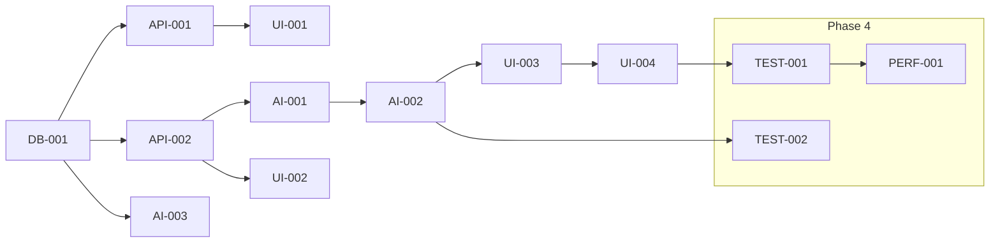

# Vibe Kanban Tasks - Enhanced Lesson Plan System

## 📋 Kanban Board Setup

This document provides task cards ready for import into your Vibe Kanban system. Tasks are organized by columns and include detailed descriptions, acceptance criteria, and dependencies.

---

## 🎯 **TODO Column** - Backlog

### 🏗️ **Phase 1: Foundation**

#### **Task: Database Schema Implementation**
**ID**: DB-001
**Priority**: Critical
**Estimate**: 3 days
**Assignee**: Backend Developer

**Description**: Create new database tables for projects, templates, and language configurations. Update existing tables to support the enhanced system.

**Acceptance Criteria**:
- [ ] Create `projects` table with proper constraints
- [ ] Create `templates` table with file storage support
- [ ] Create `language_configs` table with localized settings
- [ ] Add foreign key relationships and indexes
- [ ] Create migration scripts for existing data
- [ ] Write database documentation

**Technical Details**:
```sql
-- Key tables to implement
- projects (id, name, description, language, created_by, created_at)
- templates (id, project_id, name, type, file_path, file_content, variables)
- language_configs (id, language_code, ai_prompts, cultural_settings)
```

**Dependencies**: None
**Blockers**: None

---

#### **Task: Project Management API**
**ID**: API-001
**Priority**: Critical
**Estimate**: 4 days
**Assignee**: Backend Developer

**Description**: Implement RESTful API endpoints for project CRUD operations with proper authentication and validation.

**Acceptance Criteria**:
- [ ] POST `/api/projects` - Create new project
- [ ] GET `/api/projects` - List projects with filtering
- [ ] GET `/api/projects/:id` - Get project details
- [ ] PUT `/api/projects/:id` - Update project
- [ ] DELETE `/api/projects/:id` - Delete project
- [ ] Add input validation with Zod schemas
- [ ] Implement authentication and authorization
- [ ] Add rate limiting and error handling

**API Specification**:
```typescript
interface CreateProjectRequest {
  name: string;
  description?: string;
  language: string;
  input_format: 'excel' | 'pdf' | 'text';
}

interface ProjectResponse {
  id: string;
  name: string;
  description?: string;
  language: string;
  template_count: number;
  lesson_count: number;
  created_at: string;
}
```

**Dependencies**: DB-001
**Blockers**: None

---

#### **Task: Template Upload System**
**ID**: API-002
**Priority**: Critical
**Estimate**: 4 days
**Assignee**: Backend Developer

**Description**: Implement file upload system for template files with support for markdown and DOCX formats, including parsing and storage.

**Acceptance Criteria**:
- [ ] POST `/api/projects/:id/templates` - Upload 1-10 template files
- [ ] GET `/api/projects/:id/templates` - List project templates
- [ ] Support .md and .docx file formats
- [ ] Parse file content and extract structure
- [ ] Implement file validation (size, type, malware scan)
- [ ] Store files in cloud storage (AWS S3)
- [ ] Add duplicate detection

**Technical Requirements**:
- File size limit: 10MB per file
- Support for batch uploads (1-10 files)
- Content parsing for markdown and DOCX
- Error handling for corrupted files
- Progress tracking for uploads

**Dependencies**: DB-001, API-001
**Blockers**: None

---

### 🤖 **Phase 2: AI Enhancement**

#### **Task: Template Analysis Engine**
**ID**: AI-001
**Priority**: High
**Estimate**: 5 days
**Assignee**: AI/ML Specialist

**Description**: Create intelligent template analysis system to extract structure, variables, and formatting patterns from uploaded template files.

**Acceptance Criteria**:
- [ ] Parse markdown structure and formatting
- [ ] Extract table structures and headers
- [ ] Detect template variables (`{{variable}}` patterns)
- [ ] Analyze language patterns and style
- [ ] Generate template quality score
- [ ] Support Chinese, Vietnamese, English content

**Core Functions**:
```typescript
interface TemplateAnalysis {
  variables: Array<{
    name: string;
    type: 'string' | 'number' | 'array' | 'object';
    required: boolean;
    examples: string[];
  }>;
  structure: {
    headers: string[];
    tables: Array<{
      columns: string[];
      rows: number;
      format: string;
    }>;
    sections: string[];
  };
  quality_score: number; // 0-100
}

class TemplateAnalyzer {
  analyze(content: string): TemplateAnalysis
  detectVariables(content: string): Variable[]
  extractStructure(content: string): TemplateStructure
  validateCompleteness(analysis: TemplateAnalysis): ValidationResult
}
```

**Dependencies**: API-002
**Blockers**: None

---

#### **Task: Enhanced AI Generation**
**ID**: AI-002
**Priority**: Critical
**Estimate**: 5 days
**Assignee**: AI/ML Specialist

**Description**: Enhance AI generation to use sample template files for format enforcement, achieving >95% accuracy in template matching.

**Acceptance Criteria**:
- [ ] Integrate sample files into AI prompts
- [ ] Implement format matching algorithm
- [ ] Add quality scoring and validation
- [ ] Support multiple AI models (GLM-4.6, GPT-5-nano)
- [ ] Optimize prompt engineering
- [ ] Add fallback strategies for low-quality results

**Enhanced Generation Flow**:
```typescript
export async function generateLessonPlanWithSamples(
  lessonData: LessonData,
  templates: Template[],
  options: {
    language?: string;
    maxSamples?: number;
    qualityThreshold?: number;
  }
): Promise<GenerationResult> {
  // 1. Select best matching templates
  // 2. Analyze template structures
  // 3. Build enhanced prompt with samples
  // 4. Generate with AI
  // 5. Validate format matching
  // 6. Return result with confidence score
}
```

**Success Metrics**:
- Format accuracy >95%
- Generation time <30 seconds
- Support for 3+ template formats
- Quality scoring implemented

**Dependencies**: AI-001
**Blockers**: None

---

#### **Task: Multi-Language Framework**
**ID**: AI-003
**Priority**: High
**Estimate**: 4 days
**Assignee**: Backend Developer

**Description**: Implement language configuration system with localized AI prompts and cultural adaptation settings.

**Acceptance Criteria**:
- [ ] Create language configuration management
- [ ] Implement localized AI prompt templates
- [ ] Add cultural adaptation settings
- [ ] Support Chinese, Vietnamese, English
- [ ] Dynamic language switching
- [ ] Language-specific formatting rules

**Language Configuration**:
```typescript
interface LanguageConfig {
  code: string; // 'zh', 'vi', 'en'
  name: string;
  ai_prompts: {
    lesson_plan: string;
    analysis: string;
    summary: string;
  };
  cultural_settings: {
    classroom_structure: string;
    teaching_methods: string[];
    formality_level: 'formal' | 'informal';
  };
  formatting: {
    date_format: string;
    time_format: string;
    number_format: string;
  };
}
```

**Dependencies**: DB-001
**Blockers**: None

---

### 🎨 **Phase 3: Frontend Implementation**

#### **Task: Project Manager UI**
**ID**: UI-001
**Priority**: High
**Estimate**: 4 days
**Assignee**: Frontend Developer

**Description**: Create comprehensive project management interface with project listing, creation wizard, and settings management.

**Acceptance Criteria**:
- [ ] Project listing with search and filter
- [ ] Project creation wizard (3-step process)
- [ ] Project cards with statistics and actions
- [ ] Project settings and configuration
- [ ] Delete/archive functionality
- [ ] Responsive design (mobile, tablet, desktop)
- [ ] Accessibility compliance (WCAG 2.1)

**Component Structure**:
```typescript
// Main components
<ProjectManager />
<ProjectList />
<ProjectCard />
<ProjectWizard />
<ProjectSettings />
<ProjectStats />

// State management
interface ProjectManagerState {
  projects: Project[];
  selectedProject: Project | null;
  filters: ProjectFilters;
  loading: boolean;
  error: string | null;
}
```

**User Requirements**:
- Intuitive navigation and search
- Visual indicators for project status
- Quick actions menu
- Bulk operations support
- Export/import capabilities

**Dependencies**: API-001
**Blockers**: None

---

#### **Task: Template Manager UI**
**ID**: UI-002
**Priority**: Critical
**Estimate**: 5 days
**Assignee**: Frontend Developer

**Description**: Create template management interface with drag-and-drop upload, preview, and validation capabilities.

**Acceptance Criteria**:
- [ ] Drag & drop file upload interface
- [ ] Support for 1-10 files simultaneously
- [ ] Template preview (markdown and DOCX rendering)
- [ ] Variable detection and highlighting
- [ ] Template validation indicators
- [ ] Template editing capabilities
- [ ] Batch operations (delete, export)

**Key Features**:
```typescript
interface TemplateManagerProps {
  projectId: string;
  templates: Template[];
  onUpload: (files: File[]) => void;
  onDelete: (templateId: string) => void;
  onEdit: (templateId: string, content: string) => void;
}

// Sub-components
<TemplateUploadZone />
<TemplatePreview />
<TemplateValidator />
<VariableHighlighter />
<TemplateEditor />
<BatchOperations />
```

**Technical Requirements**:
- File upload with progress bars
- Markdown rendering with syntax highlighting
- DOCX preview using Office Online API
- Real-time validation feedback
- Undo/redo functionality

**Dependencies**: API-002, AI-001
**Blockers**: None

---

#### **Task: Enhanced Generation Dashboard**
**ID**: UI-003
**Priority**: Critical
**Estimate**: 4 days
**Assignee**: Frontend Developer

**Description**: Create unified generation interface with template selection, real-time progress, and format validation display.

**Acceptance Criteria**:
- [ ] Input file upload with preview
- [ ] Template selection with comparison view
- [ ] Real-time generation progress
- [ ] Format matching score display
- [ ] Multi-language options
- [ ] Results review and editing
- [ ] Export to multiple formats

**Dashboard Components**:
```typescript
interface GenerationDashboardProps {
  projectId: string;
  onGenerate: (config: GenerationConfig) => void;
}

// Key components
<GenerationWizard />
<FileUploader />
<TemplateSelector />
<ProgressIndicator />
<ResultsViewer />
<FormatValidation />
<LanguageSelector />
<ExportOptions />
```

**User Experience**:
- Step-by-step guided process
- Real-time feedback and progress
- Error recovery and retry options
- Batch generation capabilities
- Preview before final generation

**Dependencies**: AI-002, UI-001, UI-002
**Blockers**: None

---

#### **Task: Enhanced Workflow Components**
**ID**: UI-004
**Priority**: Medium
**Estimate**: 3 days
**Assignee**: Frontend Developer

**Description**: Update existing workflow components to integrate project context, template selection, and multi-language options.

**Acceptance Criteria**:
- [ ] Update Kanban board with project context
- [ ] Add template selection in Step 2 (Plan)
- [ ] Display format matching scores
- [ ] Add multi-language generation options
- [ ] Enhanced error handling and recovery
- [ ] Maintain existing functionality

**Workflow Updates**:
```typescript
// Enhanced Step 2: Plan
<EnhancedPlanStep
  projectId={projectId}
  templates={templates}
  selectedTemplate={selectedTemplate}
  formatScore={formatScore}
  onTemplateSelect={setSelectedTemplate}
  onGenerate={handleGeneration}
/>

// Updated validation displays
<FormatScore score={formatScore} />
<TemplateMatch percentage={matchPercentage} />
<LanguageIndicator language={selectedLanguage} />
```

**Requirements**:
- Preserve existing workflow state
- Add new features without breaking changes
- Improve error messages and user guidance
- Maintain accessibility standards

**Dependencies**: UI-003
**Blockers**: None

---

### 🧪 **Phase 4: Testing & Quality**

#### **Task: Integration Testing**
**ID**: TEST-001
**Priority**: Critical
**Estimate**: 5 days
**Assignee**: QA Engineer

**Description**: Comprehensive integration testing of the enhanced system including end-to-end workflows, API integration, and performance validation.

**Acceptance Criteria**:
- [ ] End-to-end workflow testing (upload → generate → export)
- [ ] API integration tests (all endpoints)
- [ ] File upload/download testing
- [ ] Database migration testing
- [ ] Multi-language functionality testing
- [ ] Performance and load testing
- [ ] Cross-browser compatibility testing
- [ ] Mobile responsiveness testing

**Test Coverage**:
```typescript
// Integration test scenarios
describe('Enhanced System Integration', () => {
  test('Complete workflow with multiple templates');
  test('Multi-language format preservation');
  test('Large file handling and processing');
  test('Concurrent user scenarios');
  test('Error recovery and fallbacks');
  test('Performance under load');
});
```

**Success Criteria**:
- 95% test coverage achieved
- All critical user scenarios tested
- Performance benchmarks met
- <5 critical issues identified
- Cross-browser compatibility verified

**Dependencies**: All previous tasks
**Blockers**: None

---

#### **Task: Format Accuracy Validation**
**ID**: TEST-002
**Priority**: Critical
**Estimate**: 3 days
**Assignee**: AI/ML Specialist + QA Engineer

**Description**: Implement comprehensive format validation system to ensure generated lesson plans match template formats with >95% accuracy.

**Acceptance Criteria**:
- [ ] Format matching accuracy >95%
- [ ] Variable substitution accuracy >98%
- [ ] Style preservation validation
- [ ] Multi-language format integrity
- [ ] Edge case handling
- [ ] Quality metrics dashboard

**Validation Framework**:
```typescript
interface FormatValidation {
  structure_match: number;    // Table structures, headers
  formatting_match: number;   // Markdown formatting, styles
  variable_accuracy: number;  // Correct variable substitution
  style_preservation: number; // Language style, tone
  overall_score: number;      // Weighted average
}

class FormatValidator {
  validate(generated: string, template: string): FormatValidation
  compareStructures(gen: Structure, temp: Structure): number
  checkFormatting(gen: string, temp: string): number
  validateVariables(content: string, data: LessonData): number
}
```

**Test Scenarios**:
- 100+ template variations
- Edge cases (empty variables, special characters)
- Multi-language format preservation
- Complex table structures
- Nested formatting scenarios

**Dependencies**: AI-002
**Blockers**: None

---

#### **Task: Performance Optimization**
**ID**: PERF-001
**Priority**: High
**Estimate**: 3 days
**Assignee**: Backend Developer

**Description**: Optimize system performance to meet target benchmarks for API response times, generation speed, and resource usage.

**Acceptance Criteria**:
- [ ] API response time <2 seconds
- [ ] Generation time <30 seconds
- [ ] File upload processing <10 seconds
- [ ] Database query optimization
- [ ] Memory usage optimization (<512MB per request)
- [ ] Caching implementation

**Optimization Areas**:
```typescript
// Performance targets
interface PerformanceMetrics {
  api_response_time: number;    // Target: <2s
  generation_time: number;      // Target: <30s
  upload_processing: number;    // Target: <10s
  database_query_time: number;  // Target: <100ms
  memory_usage: number;         // Target: <512MB
  concurrent_users: number;     // Target: 100
}

// Required optimizations
- Database indexing and query optimization
- Redis caching for frequently accessed data
- File processing optimization
- AI prompt context optimization
- Response compression
- CDN implementation for static assets
```

**Load Testing**:
- 100 concurrent users
- 1000+ template files per project
- 10MB file upload limit
- 24-hour sustained load testing

**Dependencies**: All previous tasks
**Blockers**: None

---

## 🚀 **IN PROGRESS** - Active Work

*(This section will be updated as tasks move from TODO to IN PROGRESS)*

---

## ✅ **DONE** - Completed

*(This section will be updated as tasks are completed)*

---

## 📋 **Task Status Tracking**

### **Progress Metrics**
- **Total Tasks**: 13
- **Completed Tasks**: 0
- **In Progress Tasks**: 0
- **Blocked Tasks**: 0
- **Completion Percentage**: 0%

### **Timeline Overview**
- **Phase 1** (Week 1-2): Foundation & Database
- **Phase 2** (Week 2-3): AI Enhancement
- **Phase 3** (Week 3-4): Frontend Implementation
- **Phase 4** (Week 4-5): Testing & Quality

### **Dependencies Visualization**


## 🎯 **Priority Matrix**

### **Critical Priority** (Must complete for MVP)
- DB-001: Database Schema
- API-001: Project Management API
- API-002: Template Upload System
- AI-002: Enhanced AI Generation
- UI-002: Template Manager UI
- UI-003: Generation Dashboard
- TEST-001: Integration Testing
- TEST-002: Format Validation

### **High Priority** (Important for full functionality)
- AI-001: Template Analysis Engine
- AI-003: Multi-Language Framework
- UI-001: Project Manager UI
- PERF-001: Performance Optimization

### **Medium Priority** (Nice to have)
- UI-004: Enhanced Workflow Components

## 📊 **Risk Assessment**

### **High Risk Tasks**
1. **AI-002: Enhanced AI Generation** - Complex prompt engineering, accuracy requirements
2. **TEST-002: Format Validation** - Quality standards, edge case handling
3. **UI-002: Template Manager** - File processing, preview complexity

### **Medium Risk Tasks**
1. **API-002: Template Upload** - File handling, storage integration
2. **AI-001: Template Analysis** - Natural language processing complexity
3. **PERF-001: Performance Optimization** - Multiple optimization areas

### **Low Risk Tasks**
1. **DB-001: Database Schema** - Standard database work
2. **API-001: Project Management** - CRUD operations
3. **UI-001: Project Manager** - Standard React components

## 🔧 **Resource Allocation**

### **Backend Developer** (40% allocation)
- DB-001: Database Schema (3 days)
- API-001: Project Management API (4 days)
- API-002: Template Upload System (4 days)
- AI-003: Multi-Language Framework (4 days)
- PERF-001: Performance Optimization (3 days)

### **AI/ML Specialist** (35% allocation)
- AI-001: Template Analysis Engine (5 days)
- AI-002: Enhanced AI Generation (5 days)
- TEST-002: Format Validation (3 days)

### **Frontend Developer** (20% allocation)
- UI-001: Project Manager UI (4 days)
- UI-002: Template Manager UI (5 days)
- UI-003: Generation Dashboard (4 days)
- UI-004: Enhanced Workflow (3 days)

### **QA Engineer** (5% allocation)
- TEST-001: Integration Testing (5 days)

---

**Ready to import into Vibe Kanban!** 🎉

Each task card includes:
- Unique ID for tracking
- Clear priority and time estimates
- Detailed acceptance criteria
- Technical specifications
- Dependencies and blockers
- Success metrics

Use this structure to create your Kanban board and track progress throughout the implementation.